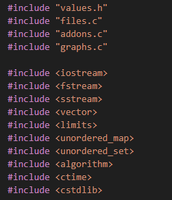
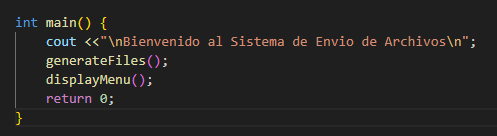
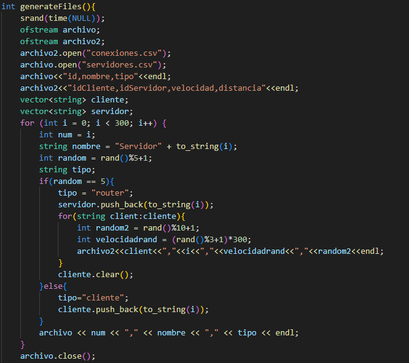
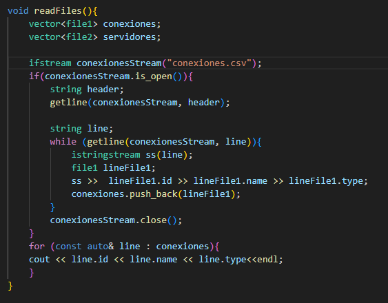
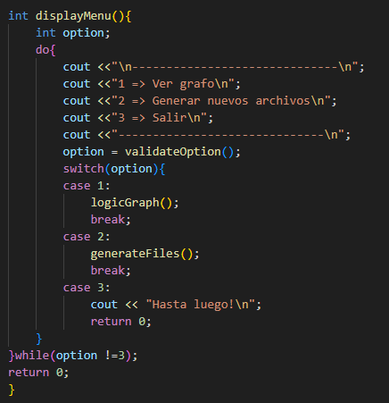
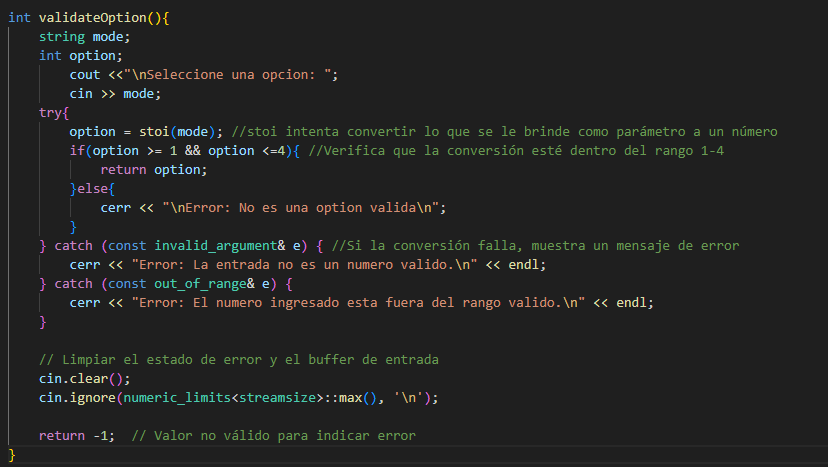
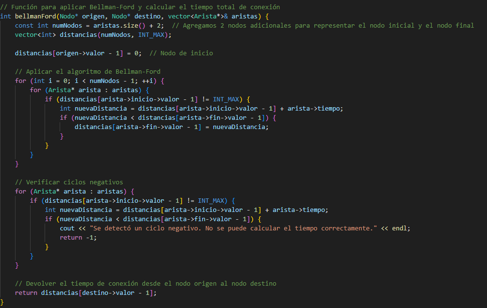
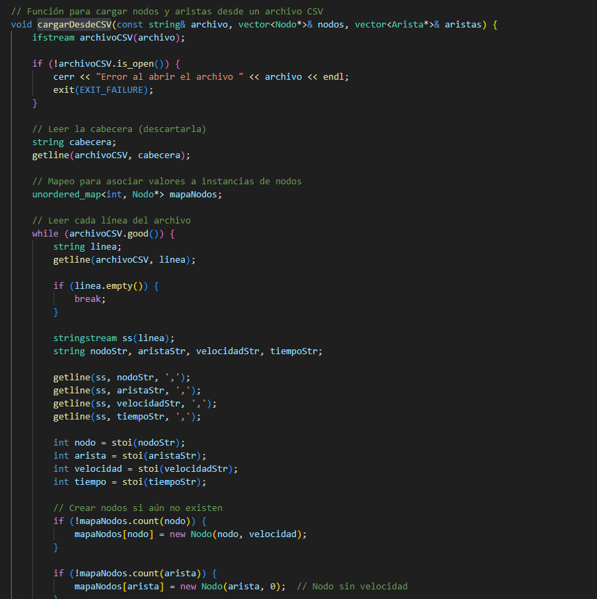
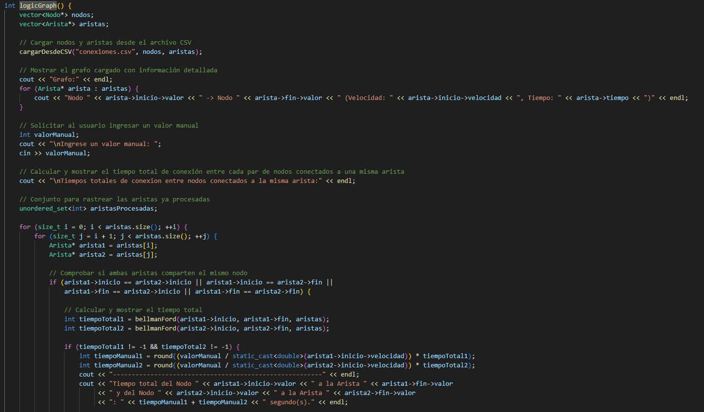

<!-- LOGO -->
 

    
 <!-- TITULO -->   
  

    Estructura de Datos Taller 3 - Anais Rodriguez
  

<!-- INDICE -->

  
Indice

  <ol>
    <li>
        <a href="#resumen-del-taller">Resumen del Taller</a>
    </li>
    <li>
        <a href="#librerías">Librerías</a>
    </li>
    <li>
        <a href="#código">Código</a>
        <ul>
          <li><a href="#main">main</a></li>
          <li><a href="#generateFiles">generateFiles</a></li>
          <li><a href="#readFiles">readFiles</a></li>
          <li><a href="#displayMenu">displayMenu</a></li>
          <li><a href="#validateOption">validateOption</a></li>
          <li><a href="#bellmanFord">bellmanFord</a></li>
          <li><a href="#cargarDesdeCSV">cargarDesdeCSV</a></li>
          <li><a href="#logicGraph">logicGraph</a></li>
      </ul>
    </li>
  </ol>

<!-- RESUMEN DEL TALLER -->
## Resumen del Taller
Se desarrolló el algoritmo para una Aplicación de Mensajería:

* Se deben leer 2 archivos csv.
* Por consola se debe poder visualizar el Grafo generado.
* Por consola se debe poder visualizar el tiempo total de nodo a nodo.
* Por consola se debe poder visualizar el camino más corto entre nodo y nodo.
* Por consola se debe poder ingresar el tamaño del archivo a enviar.

# Librerías
Se están utilizando un total de 8 librerías, las cuales se muestran a continuación.

    
    
main.cpp

# Código
A continuación se detallan las funcionas usadas en la creación del taller.

## main
Función de tipo `int`, utilizada para generar por primera vez los archivos csv y mostrar el menú al usuario.
Permite ver el grafo e ingresar el peso del archivo, también permite volver a generar los archivos. 

    
    
main.cpp

(<a href="#arriba">Ir a Inicio</a>)

## generateFiles
Función de tipo `int`, utilizada para generar los 2 archivos con valores completamente aleatorios.

    
    
files.c

(<a href="#arriba">Ir a Inicio</a>)

## readFiles

Función de tipo `void`, utilizada para leer el archivo de las conexiones generadas. 

    
    
files.c

(<a href="#arriba">Ir a Inicio</a>)

## displayMenu

Función de tipo `int`, donde se invoca toda la lógica de la aplicación: 

* Ver grafo
* Generar nuevos archivos

    
    
addons.c

(<a href="#arriba">Ir a Inicio</a>)

## validateOption

Función de tipo `int`, utilizada para validar que la opción ingresada por el usuario sea válida. 

    
    
addons.c

(<a href="#arriba">Ir a Inicio</a>)

## bellmanFord

Función de tipo `int`, utilizada para obtener el tiempo total de conexión entre un nodo y otro, posteriormente evaluar el camino más corto. 

    
    
graph.c

(<a href="#arriba">Ir a Inicio</a>)

## cargarDesdeCSV

Función de tipo `void`, utilizada para cargar los nodos y aristas del grafo usando los archivos generados.

    
    
graph.c

(<a href="#arriba">Ir a Inicio</a>)

## logicGraph

Función de tipo `int`, utilizada para invocar todas las demás funciones, a su vez también está mostrando el detalle del grafo y el tiempo de conexión entre nodos agrupados por aristas en común. 

    
    
graph.c

(<a href="#arriba">Ir a Inicio</a>)

